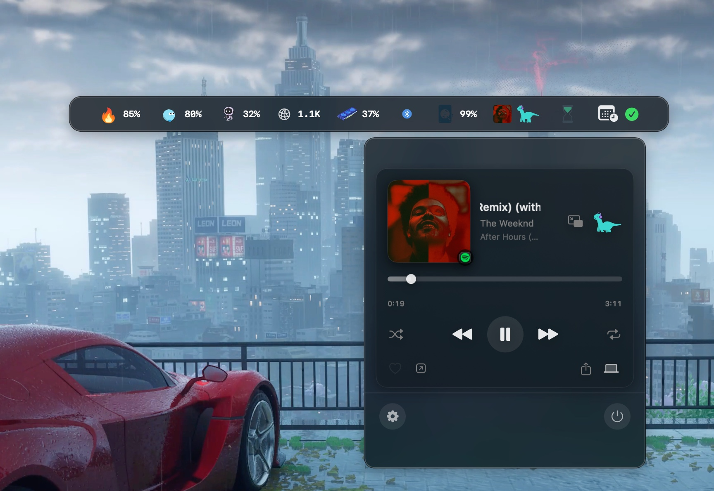
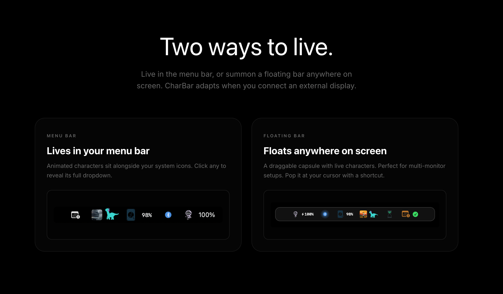
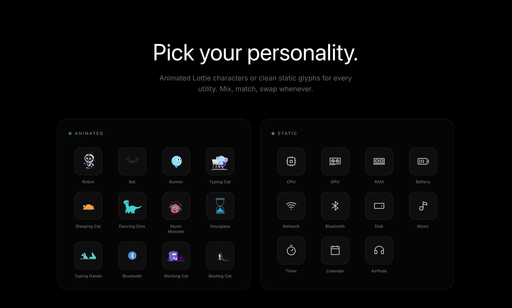
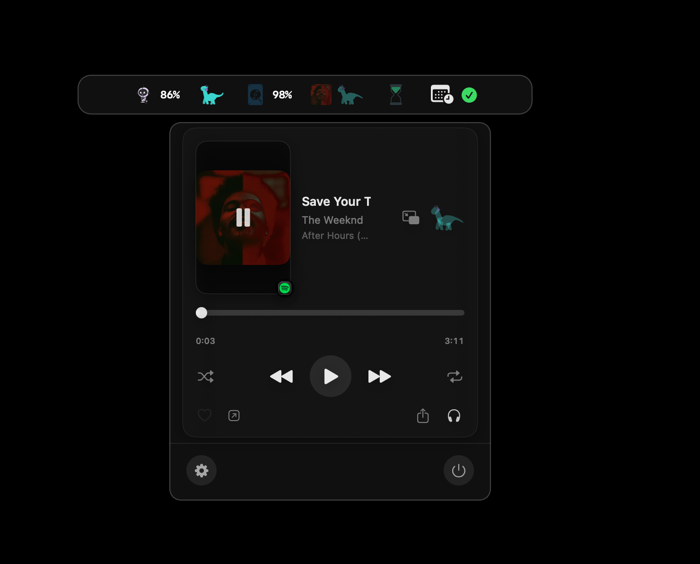
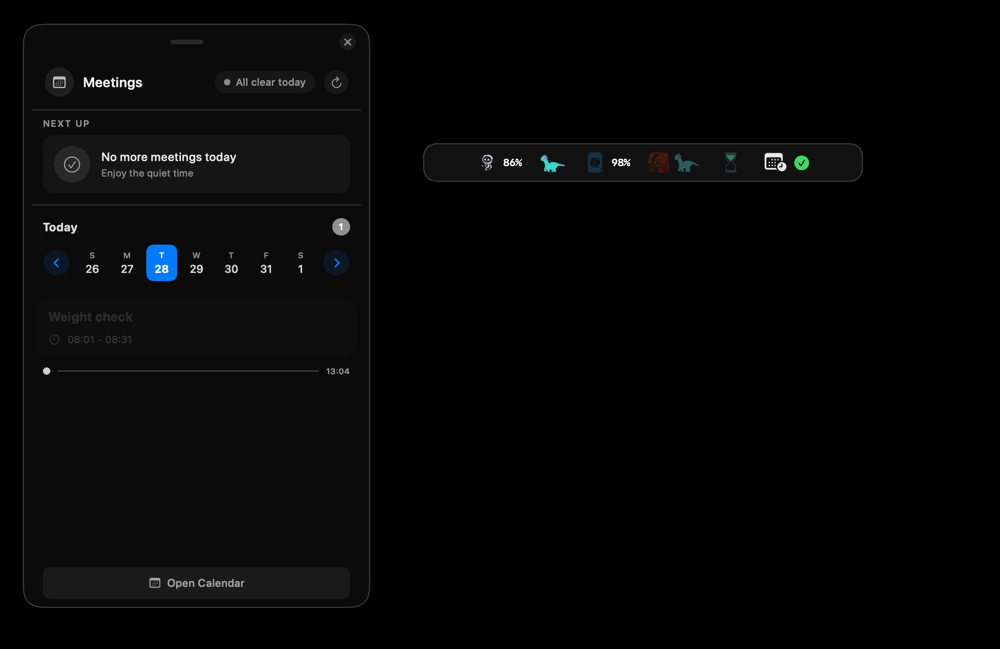
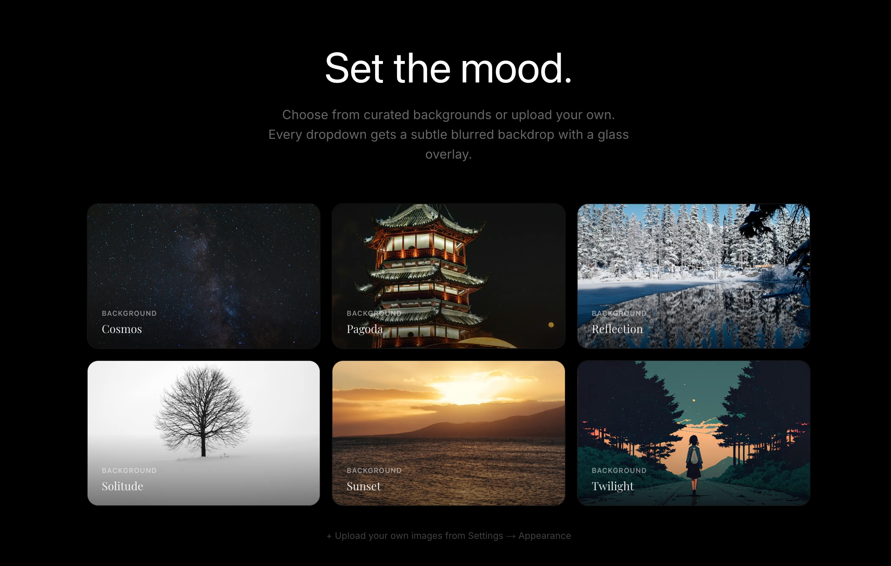
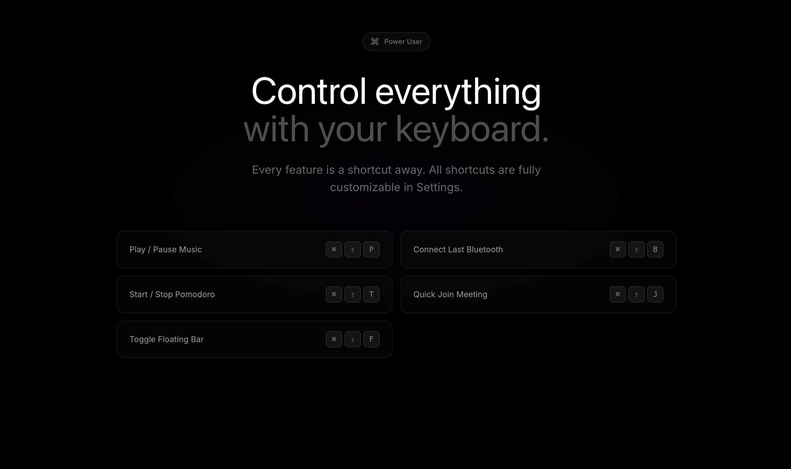

<div align="center">

# CharBar

### Your Mac's menu bar, with a personality.

Animated Lottie characters that live in your menu bar, or float anywhere on screen, packing your music, meetings, Pomodoro, Bluetooth, and system stats into one playful, glanceable bar.

<br/>

<a href="https://github.com/MonishSoundarRaj/CharBar/releases/latest/download/CharBar.dmg">
  
</a>

<br/>

<sub>Not notarized yet, so the first launch needs one quick step. Read the <b>Install</b> and <b>Requirements</b> sections below before running it.</sub>

<br/><br/>


<br/>



</div>

---

## ✨ What is CharBar?

CharBar turns your menu bar into a living dashboard. Each utility (CPU, GPU, RAM, battery, network, disk, Bluetooth, music, Pomodoro, calendar) is its own animated character, or a clean static glyph if you prefer. Click any of them to reveal a full, glassy dropdown. Everything runs locally on your Mac.

## 🪟 Two ways to live

Keep it classic in the macOS menu bar, or summon a **draggable floating bar** anywhere on screen, perfect for multi-monitor setups. CharBar can even swap modes automatically when you connect an external display.

<div align="center">

</div>

## 🦖 Pick your personality

Mix and match **animated Lottie characters** (Dancing Dino, Music Monster, Working Cat, Robot, Typing Hands, and more) with **clean static glyphs** for every utility. Swap them whenever the mood changes.

<div align="center">

</div>

## 🎵 Now playing

A full media player right in your bar: album art, scrubbing, shuffle/repeat, and one-click AirPlay. Works with Apple Music and Spotify.

<div align="center">

</div>

## 📅 Meetings at a glance

See your next meeting, a live day strip, and countdowns to what's next, with one-click join for video calls.

<div align="center">

</div>

## 🎨 Set the mood

Give every dropdown a subtle blurred backdrop. Choose from curated backgrounds (Cosmos, Pagoda, Reflection, Solitude, Sunset, Twilight) or upload your own.

<div align="center">

</div>

## ⌨️ Control everything with your keyboard

Every feature is a shortcut away, and all of them are customizable in Settings.

| Action | Shortcut |
|--------|----------|
| Play / Pause Music | `⌘ ⇧ P` |
| Start / Stop Pomodoro | `⌘ ⇧ T` |
| Toggle Floating Bar | `⌘ ⇧ F` |
| Connect Last Bluetooth | `⌘ ⇧ B` |
| Quick Join Meeting | `⌘ ⇧ J` |

<div align="center">

</div>

---

## 📦 Features at a glance

- 🖥️ **Live system stats**: CPU, GPU, RAM, battery, network, disk usage with sparkline history
- 🎵 **Music player**: Apple Music and Spotify, album art, scrubbing, AirPlay
- 🎧 **One-click Bluetooth**: reconnect your last device instantly, see AirPods dual battery
- 🍅 **Pomodoro timer**: focus sessions with sound cues and notifications
- 📅 **Meetings and calendar**: next-up countdowns and one-click join
- 🦖 **Animated or static**: Lottie characters or minimal glyphs, per utility
- 🪟 **Menu bar or floating bar**: adapts to external displays
- 🎨 **Custom backgrounds**: curated wallpapers or your own
- ⌨️ **Fully customizable shortcuts**
- 🔄 **Auto-updates** via Sparkle

## ✅ Requirements

- **macOS 26 (Tahoe) or later**

## ⬇️ Install

1. **[Download CharBar.dmg](https://github.com/MonishSoundarRaj/CharBar/releases/latest/download/CharBar.dmg)**
2. Open the DMG and drag **CharBar** into **Applications**.
3. Launch it. This build isn't notarized yet, so macOS blocks it on first launch with *"Apple could not verify CharBar is free of malware."* On **macOS Tahoe** the dialog only has a **Done** button. To actually open the app:
   - Click **Done**, then open **System Settings > Privacy & Security**, scroll to the bottom, and click **Open Anyway**, then confirm with **Open Anyway** again.
   - Or, from Terminal: `xattr -dr com.apple.quarantine /Applications/CharBar.app`
4. Grant **Accessibility** and **Bluetooth** permissions when prompted (needed for shortcuts and one-click connect). Everything is processed locally, and nothing leaves your Mac.

## 🛠️ Build from source

```bash
git clone https://github.com/MonishSoundarRaj/CharBar.git
cd charbar
open CharBar.xcodeproj
# Build and run the "CharBar" scheme (⌘R) in Xcode
```

Dependencies are resolved automatically via Swift Package Manager:
- [Sparkle](https://github.com/sparkle-project/Sparkle): auto-updates
- [Lottie](https://github.com/airbnb/lottie-ios): character animations
- [KeyboardShortcuts](https://github.com/sindresorhus/KeyboardShortcuts): global hotkeys

### Package for distribution

`Scripts/notarize.sh` archives, signs with Developer ID, notarizes, staples, and builds a DMG (requires a Developer ID certificate and notary profile). See `SETUP_GUIDE.md` for the full setup.

## 🔒 Privacy

CharBar is a local-only utility. System stats, media info, Bluetooth state, and calendar data are read on-device to power the UI and are **never transmitted to any server**.

## 📄 License

CharBar is released under the **[Apache License 2.0](LICENSE)**: free to use, modify, and distribute, with an explicit patent grant.

Bundled third-party code and assets keep their own licenses. See **[THIRD_PARTY_LICENSES.md](THIRD_PARTY_LICENSES.md)**. In short: the source is Apache-2.0, while background photos (Unsplash) and Lottie animations (LottieFiles) remain under their original terms.

---

<div align="center">
Created with Claude Code and ❤️
</div>
